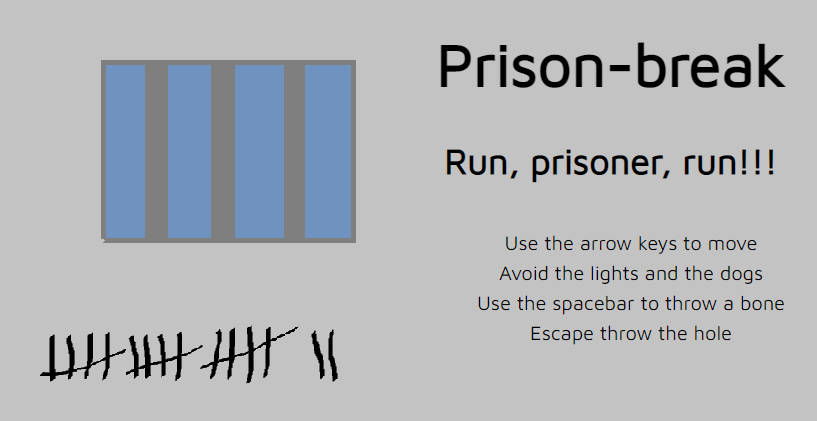
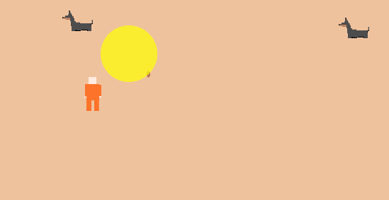

# PRISON BREAK

## Descripcion

For this project, I wanted to focus on OOP gaming, implementing arrow key events, detecting collisions and making the character able to *shoot* against his enemies.

### How to play

The prisoner must reach the hole to escape from prison. You can move up, down, right and left using the arrow keys. 

Be careful with the lights and the dogs! 

You can throw a bone against a dog to make it disappear.

### Let's play!

[Click here to play the demo](https://cametolearnthis.github.io/prison-breaking-game/index.html)

